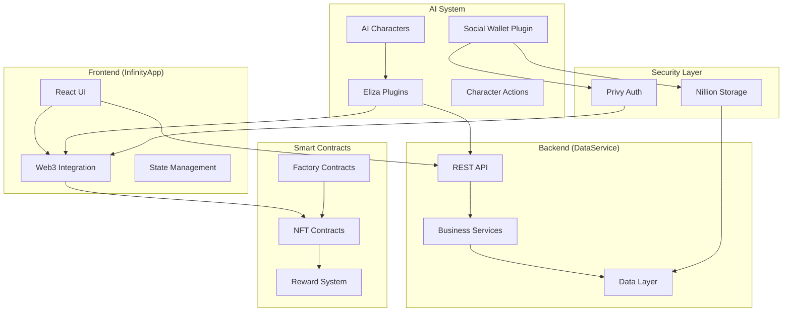
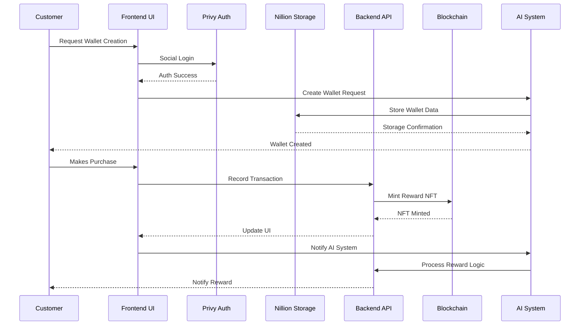
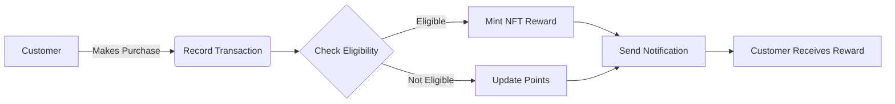
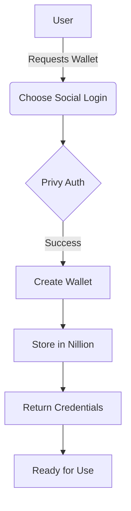
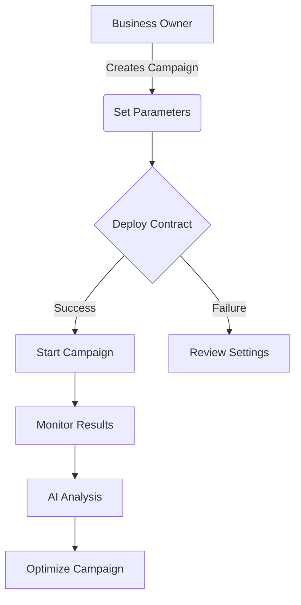
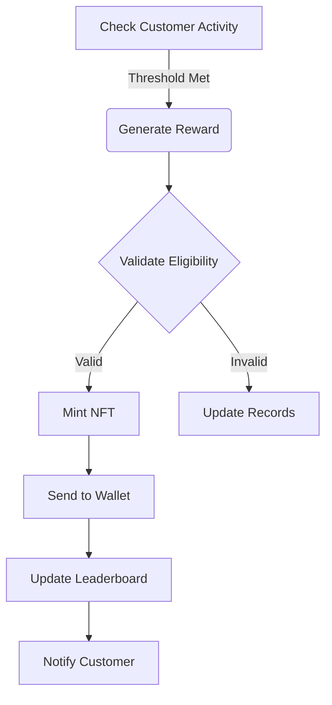
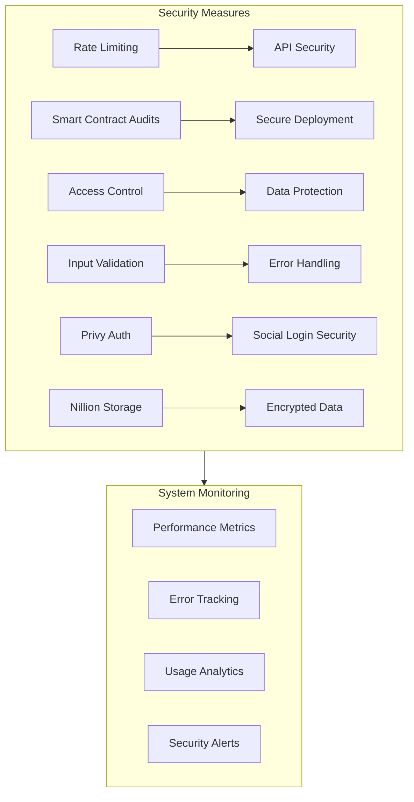
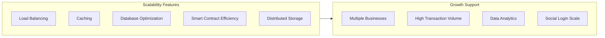

# Infinity System Architecture

## 📑 Table of Contents
- [System Overview](#-system-overview)
- [Architecture Diagrams](#-architecture-diagrams)
- [Use Cases](#-use-cases)
- [Technologies](#-technologies)

## 🔍 System Overview

Infinity is a blockchain-powered loyalty system that enables businesses to create and manage customer rewards programs using NFTs and smart contracts. The system includes social wallet creation through Privy and secure data storage with Nillion.

## 📐 Architecture Diagrams

### System Components

### Data Flow

## 📋 Use Cases

### Customer Loyalty Flow

### Social Wallet Creation Flow

### Business Management Flow

### Reward Distribution Flow

## 🛠 Technologies

### Frontend
- **Framework**: React 18.x
- **Build Tool**: Vite
- **State Management**: React Query
- **UI Components**: Radix UI
- **Styling**: Tailwind CSS
- **Web3**: Ethers.js
- **Authentication**: Privy Social Login

### Backend
- **Runtime**: Node.js 22.x
- **Framework**: Express 4.x
- **Language**: TypeScript 5.x
- **Architecture**: Clean Architecture
- **Security**: Helmet, Rate Limiting
- **Logging**: Winston
- **Storage**: Nillion Secure Storage

### Blockchain
- **Language**: Solidity ^0.8.0
- **Framework**: Hardhat
- **Testing**: Hardhat Test Suite
- **Network**: Base Sepolia
- **Standards**: ERC721

### AI System
- **Platform**: Eliza OS
- **Model**: Anthropic Claude
- **Voice**: Alan Medium
- **Plugins**: 
  - Custom TypeScript Plugins
  - Social Wallet Plugin (Privy + Nillion)

### Development Tools
- **Version Control**: Git
- **Package Manager**: pnpm/yarn
- **Testing**: Vitest
- **Linting**: ESLint
- **Formatting**: Prettier
- **Documentation**: Markdown

## 🔐 Security Considerations

## 📈 Scalability

---

### Built with 💫 by the Infinity Team

