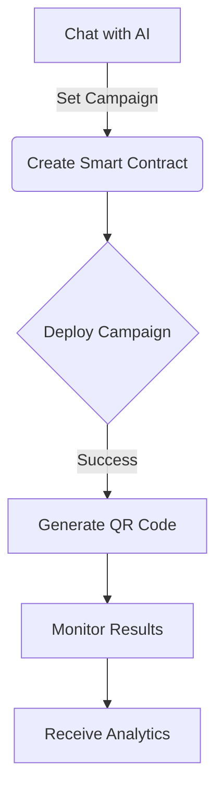
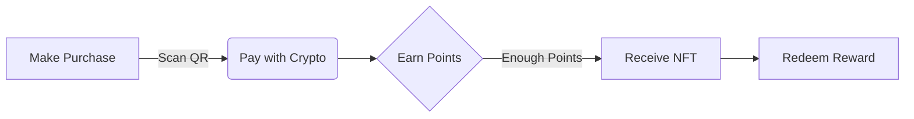

# Infinity - AI-Powered Loyalty System

## 🌟 Project Overview

Infinity is an AI-powered loyalty system that revolutionizes how small businesses create and manage promotional campaigns. Through a simple chat interface, business owners can launch, manage, and track promotional offers using blockchain technology and AI.

### 🎯 Key Features
- 💬 Chat-based campaign creation
- 🎫 Automated NFT reward distribution
- 📊 Real-time analytics and tracking
- 🔄 Seamless redemption process
- 📱 Mobile and desktop accessibility

## 🚀 Quick Start

1. **Connect Your Wallet**
   - Use social login for new Web3 users
   - Or connect existing wallet

2. **Fund Your Account**
   - Subscribe to Infinity AaaS
   - Fund gas fees for operations

3. **Create Campaign**
   - Chat with AI to set parameters
   - Automatic smart contract deployment
   - Instant NFT creation

4. **Monitor & Optimize**
   - Track campaign performance
   - Analyze customer engagement
   - Adjust based on AI insights

## 💡 How It Works

### For Business Owners

### For Customers

## 🛠 Technology Stack

### Blockchain Layer
- Smart Contracts (Solidity)
- NFT Management (ERC721)
- Base Sepolia Network

### AI System
- Eliza OS Platform
- Anthropic Claude Model
- Custom AI Plugins

### Frontend
- React/Vite
- Web3 Integration
- Mobile Responsive UI

### Backend
- Node.js/Express
- Clean Architecture
- Secure API Layer

## 📚 Available Documentation

### Core Documentation
- [System Architecture](ARCHITECTURE.md) - Complete system design and flows
- [Technical Documentation](docs/README.md) - Development guides and setup

### Component Documentation
1. [Frontend Application](InfinityApp/README.md)
   - UI Components
   - Web3 Integration
   - State Management

2. [Smart Contracts](InfinityContracts/README.md)
   - NFT Implementation
   - Reward System
   - Contract Deployment

3. [Backend Service](DataService/readme.md)
   - API Documentation
   - Service Layer
   - Data Management

4. [AI Characters](ElizaCharacters/README.md)
   - Character Definitions
   - Interaction Models
   - Response Templates

5. [Eliza Plugins](ElizaPlugins/README.md)
   - Plugin Architecture
   - Integration Points
   - Custom Actions

### Technical Guides
- [Plugin Development](docs/plugin-infinity.md)
- [Running Characters](docs/running-characters.md)
- [System Analysis](docs/analisis/README.md)

## 🔄 Process Flow

### Campaign Creation
1. Business owner chats with AI agent
2. AI collects campaign requirements
3. Smart contract automatically deployed
4. NFT rewards configured
5. QR codes generated
6. Social media content created

### Reward Distribution
1. Customer makes purchase
2. Points automatically tracked
3. NFT rewards minted when eligible
4. Digital rewards sent to customer wallet
5. Automated redemption verification
6. Analytics updated in real-time

## 📊 Analytics & Insights

The system provides:
- Campaign performance metrics
- Customer engagement data
- Redemption statistics
- ROI calculations
- Trend analysis
- Optimization suggestions

## 🛡️ Security Features

- Secure wallet integration
- Smart contract auditing
- Automated verification
- Fraud prevention
- Data encryption
- Access control

## 🤝 Contributing

See our [Contributing Guide](CONTRIBUTING.md) for details on:
- Code standards
- Development workflow
- Testing requirements
- Documentation guidelines

## 📄 License

This project is licensed under the INFINITY License - see the [LICENSE](LICENSE) file for details.

---

### Built with 💫 by the Infinity Team

[Website](https://infinity.team) • [Documentation](https://docs.infinity.team) • [GitHub](https://github.com/infinity)

