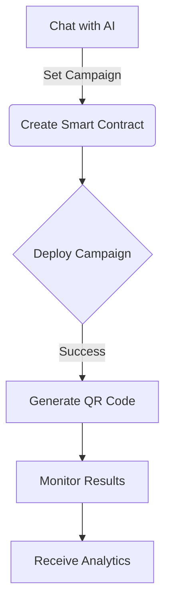
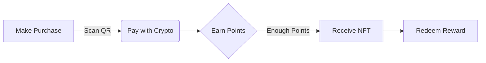

# Infinity - AI-Powered Loyalty System

## 🌟 Project Overview

Infinity is an AI-powered loyalty system that revolutionizes how small businesses create and manage promotional campaigns. Through a simple chat interface, business owners can launch, manage, and track promotional offers using blockchain technology and AI.

### 🎯 Key Features
- 💬 Chat-based campaign creation
- 🎫 Automated NFT reward distribution
- 📊 Real-time analytics and tracking
- 🔄 Seamless redemption process
- 📱 Mobile and desktop accessibility
- 🔐 Social login wallet creation with Privy
- 🛡️ Secure wallet data storage with Nillion
- 💰 Product sales management with implicit wallet handling

## 🚀 Quick Start

📖 **[QUICK START](QUICK_START.md)**

## 💡 How It Works

### For Business Owners

### For Customers

## 🛠 Technology Stack

### Blockchain Layer
- Smart Contracts (Solidity)
- NFT Management (ERC721)
- Base Sepolia Network

### AI System
- Eliza OS Platform
- Anthropic Claude Model
- Custom AI Plugins
- Social Wallet Creation Plugin (Privy + Nillion)

### Frontend
- React/Vite
- Web3 Integration
- Mobile Responsive UI

### Backend
- Node.js/Express
- Clean Architecture
- Secure API Layer

## 📚 Available Documentation

### Core Documentation
- [System Architecture](ARCHITECTURE.md) - Complete system design and flows
- [Technical Documentation](docs/README.md) - Development guides and setup

### Component Documentation
1. [Frontend Application](InfinityApp/README.md)
   - UI Components
   - Web3 Integration
   - State Management

2. [Smart Contracts](InfinityContracts/README.md)
   - NFT Implementation
   - Reward System
   - Contract Deployment

3. [Backend Service](DataService/readme.md)
   - API Documentation
   - Service Layer
   - Data Management

4. [AI Characters](docs/INFINITY_CHARACTERS.md)
   - Character Definitions
   - Interaction Models
   - Response Templates

5. [Eliza Plugins](docs/INFINITY_PLUGINS.md)
   - Plugin Architecture
   - Integration Points
   - Custom Actions

## 🔄 Process Flow

### Campaign Creation
1. Business owner chats with AI agent
2. AI collects campaign requirements
3. Smart contract automatically deployed
4. NFT rewards configured
5. QR codes generated
6. Social media content created

### Reward Distribution
1. Customer makes purchase
2. Points automatically tracked
3. NFT rewards minted when eligible
4. Digital rewards sent to customer wallet
5. Automated redemption verification
6. Analytics updated in real-time

## 📊 Analytics & Insights

The system provides:
- Campaign performance metrics
- Customer engagement data
- Redemption statistics
- ROI calculations
- Trend analysis
- Optimization suggestions

## 🛡️ Security Features

- Secure wallet integration with Privy social login
- Smart contract auditing
- Automated verification
- Fraud prevention
- Data encryption with Nillion
- Access control
- Secure wallet data storage

## 🏆 ETHGlobal Agents Tracks

|  |  |  |  |  |
|:---:|:---:|:---:|:---:|:---:|
| [**Coinbase**](TRACKS.md#coinbase-developer-platform-tracks-20000) | [**Base**](TRACKS.md#base-track-10000) | [**Privy**](TRACKS.md#privy-track-5000) | [**The Graph**](TRACKS.md#the-graph-track-5000) | [**Nillion**](TRACKS.md#nillion-track-5000) |

### Built with 💫 by the Infinity Team

[Website](https://infinityagent.xyz/) • [Documentation]([https://github.com/infinity](https://github.com/JulioMCruz/Infinity/tree/main))

