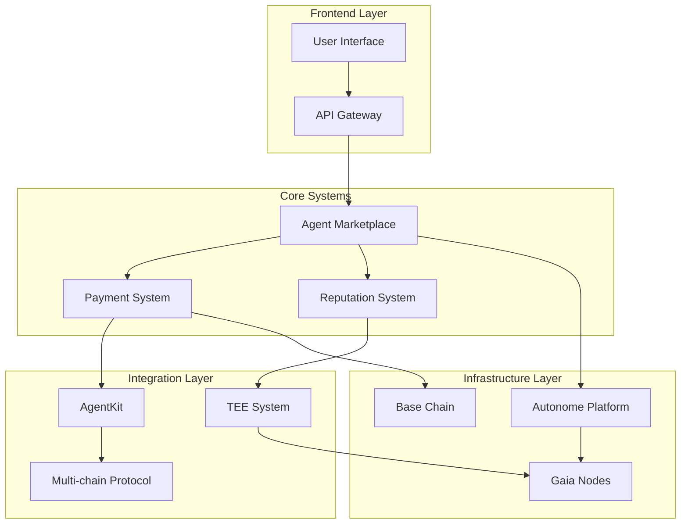
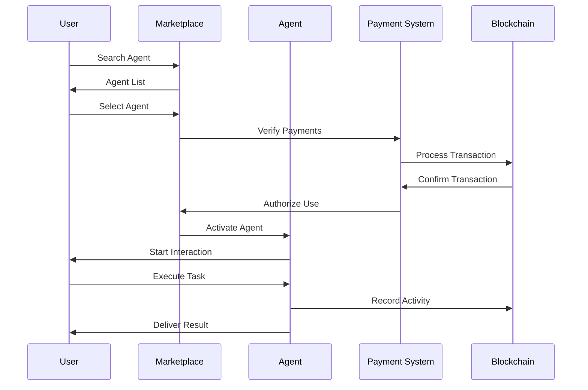
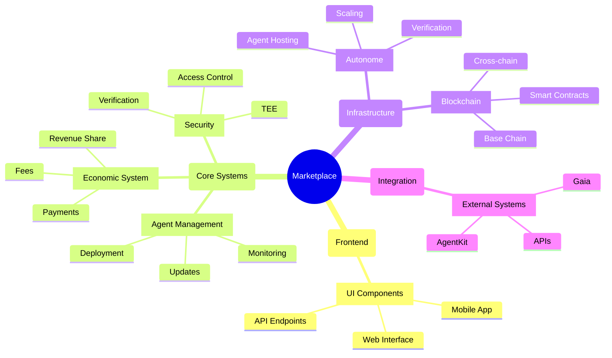
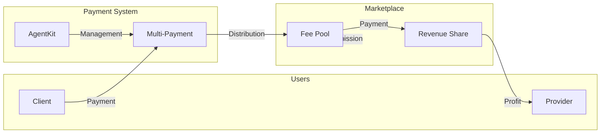
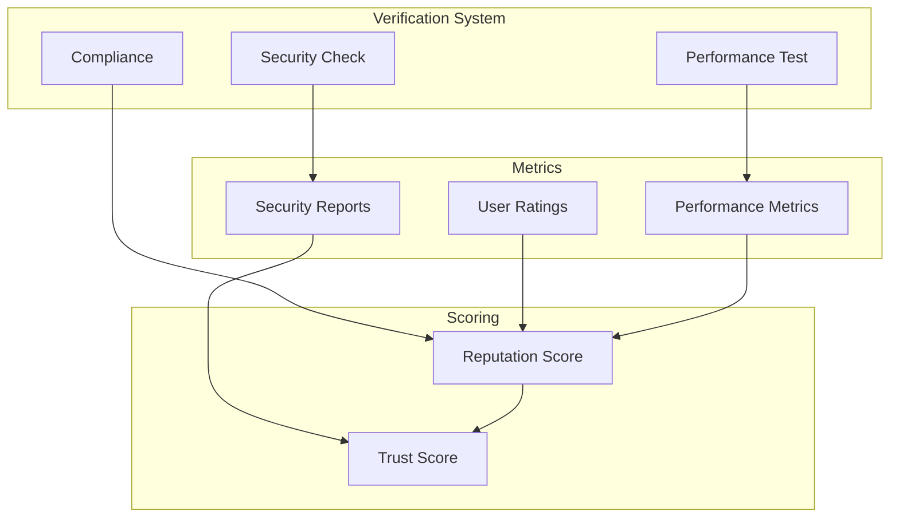

# AI Agents Marketplace Visualizations

## General System Architecture
- **Purpose**: Show the general marketplace structure and its main components
- **Audience**: Developers and technical stakeholders
- **Key Elements**: Core components, integrations, data flows
- **Notes**: Connections show main dependencies

## Agent Interaction Flow
- **Purpose**: Visualize the interaction process between users and agents
- **Audience**: Agent developers and technical users
- **Key Elements**: Operation sequence, interaction points
- **Notes**: Focus on main usage flow

## Component Hierarchy
- **Purpose**: Show the hierarchical organization of system components
- **Audience**: Architects and developers
- **Key Elements**: Organizational structure, dependencies
- **Notes**: Focus on modularity and extensibility

## Monetization Flow
- **Purpose**: Visualize the marketplace's economic system
- **Audience**: Business stakeholders and developers
- **Key Elements**: Economic flows, revenue models
- **Notes**: Focus on economic sustainability

## Reputation and Verification System
- **Purpose**: Show the agent verification and evaluation process
- **Audience**: Agent developers and users
- **Key Elements**: Metrics, verification processes
- **Notes**: Focus on reliability and security

## Implementation Notes
1. **Design Decisions**:
   - Modular architecture to facilitate extensions
   - Clear separation of responsibilities
   - Standardized interfaces

2. **Identified Limitations**:
   - Complexity in multi-chain integrations
   - Latency in TEE verifications
   - Scalability of Gaia nodes

3. **Future Improvements**:
   - Data flow optimization
   - Verification automation
   - Integration expansion

4. **Complexity Areas**:
   - Distributed state management
   - Agent coordination
   - Multi-chain synchronization
