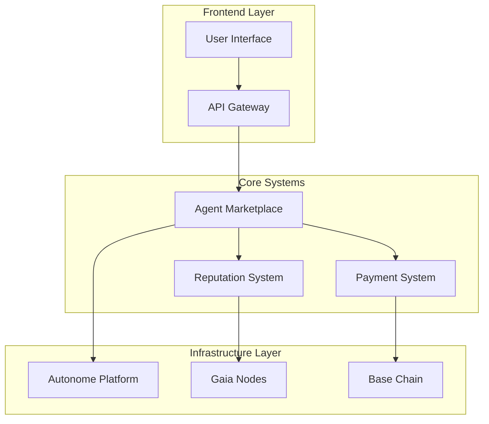

# Final Report: AI Agents Marketplace for ETH Agentic Hackathon

## Executive Summary

This report details the research and analysis for developing an AI agents marketplace in the context of the ETH Agentic Hackathon. The proposal aims to create a platform where users can hire, rent, or lend AI agents, leveraging the technologies and prizes offered by the hackathon sponsors.

### Main Objectives
- Create a decentralized AI agents marketplace
- Maximize hackathon prize opportunities
- Develop a technically sound and scalable solution

### Identified Potential Prizes
- Autonome: $7,000 (Best DeFAI Agent)
- Coinbase: $7,500 (Most Innovative)
- Base: $2,000
- Gaia: $2,500 (Mother of All Agents)
**Total Potential**: $19,000

## Methodology

### Analysis Process
1. Market and opportunity analysis
2. System taxonomy development
3. Key concepts identification
4. Relationship and dependency analysis
5. Architecture and flow visualization
6. Trends and future direction analysis

### Tools and Frameworks
- Autonome Platform for agent hosting
- Coinbase's AgentKit for crypto integration
- Base for L2 deployment
- Gaia Network for agent infrastructure

## Key Findings

### 1. Identified Core Components
- Autonomous Agents System
- Multi-token Monetization System
- Decentralized Deployment Infrastructure
- Reputation and Verification System
- Agent Development Framework

### 2. Key Opportunities
- Multi-framework agent integration
- Innovative economic system
- Enhanced verifiability and security
- Simplified user experience

### 3. Competitive Advantages
- TEE usage for security
- Multi-chain support
- Robust reputation system
- Flexible monetization

## Detailed Analysis

### Technical Architecture

### Economic System
- AgentKit integration for payments
- Revenue sharing models
- Staking and reputation system
- L2 cost optimization

### Security and Verification
- TEE for secure execution
- Metrics-based reputation system
- Automatic agent verification
- Continuous monitoring

## Conclusions

### Project Strengths
1. **Technological**:
   - Modular and scalable architecture
   - Integration with leading platforms
   - Robust security

2. **Market**:
   - Clear value proposition
   - Sustainable economic model
   - Growth potential

3. **Competitive**:
   - Alignment with hackathon tracks
   - Innovative use of technologies
   - Focus on UX

### Identified Challenges
1. **Technical**:
   - Multi-chain integration complexity
   - Verification scalability
   - Cost optimization

2. **Market**:
   - Initial adoption
   - User education
   - Potential competition

## Recommendations

### Implementation Plan

1. **Phase 1: MVP (Hackathon)**
   - Implement core on Autonome
   - Integrate AgentKit for payments
   - Develop basic UI
   - Deploy on Base

2. **Phase 2: Expansion**
   - Add more agent types
   - Implement governance
   - Expand integrations
   - Improve UX

3. **Phase 3: Maturity**
   - Implement DAO
   - Expand cross-chain
   - Optimize systems
   - Scale community

### Hackathon Strategy

1. **Development Prioritization**
   - Focus on features for specific prizes
   - Modular and reusable development
   - Thorough testing
   - Clear documentation

2. **Presentation**
   - Innovation-focused demo
   - Emphasis on technical integration
   - Show future potential
   - Highlight user impact

### Prize Maximization

1. **Autonome Track**
   - Emphasize innovative TEE usage
   - Demonstrate scalability
   - Show verifiability

2. **Coinbase Track**
   - Highlight creative AgentKit usage
   - Show multi-chain integration
   - Emphasize simplified UX

3. **Base Track**
   - Demonstrate L2 optimization
   - Show cost efficiency
   - Emphasize accessibility

4. **Gaia Track**
   - Highlight node usage
   - Show customization
   - Emphasize decentralization

## Appendices

### A. Technical References
- Autonome Documentation
- AgentKit Guides
- Base Specifications
- Gaia APIs

### B. Key Metrics
- Agent performance
- Operation costs
- Response times
- Security metrics

### C. Additional Resources
- Code repository
- API documentation
- Integration guides
- Presentation material
