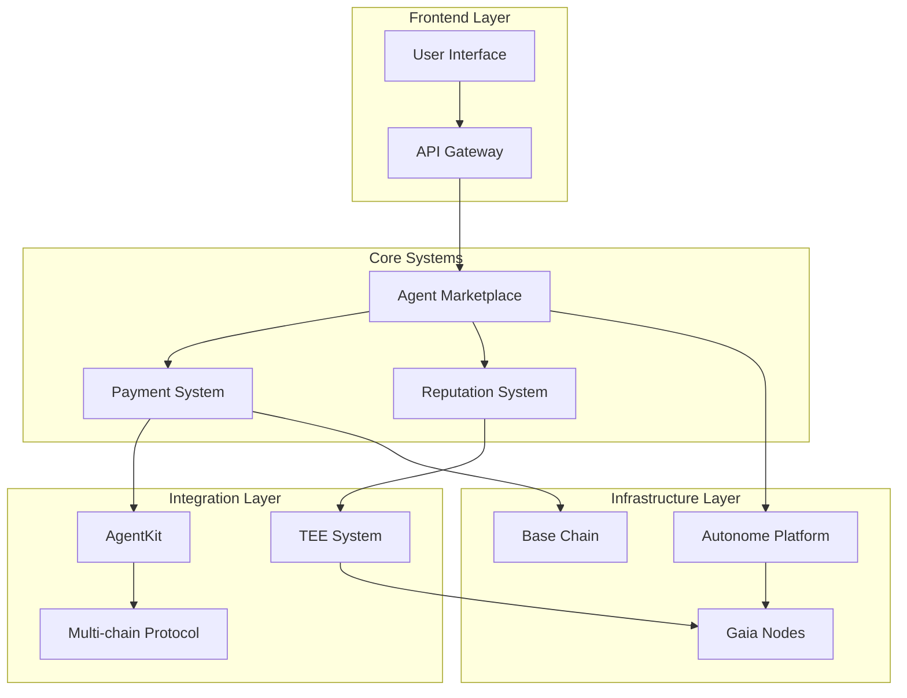
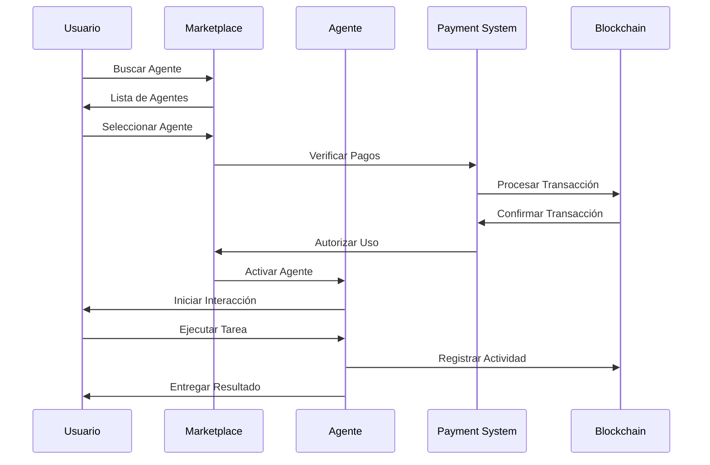
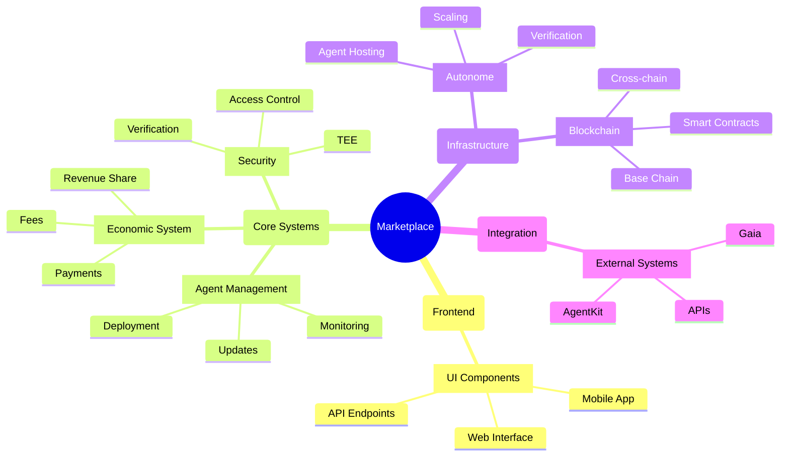
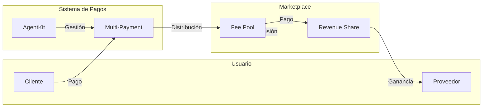
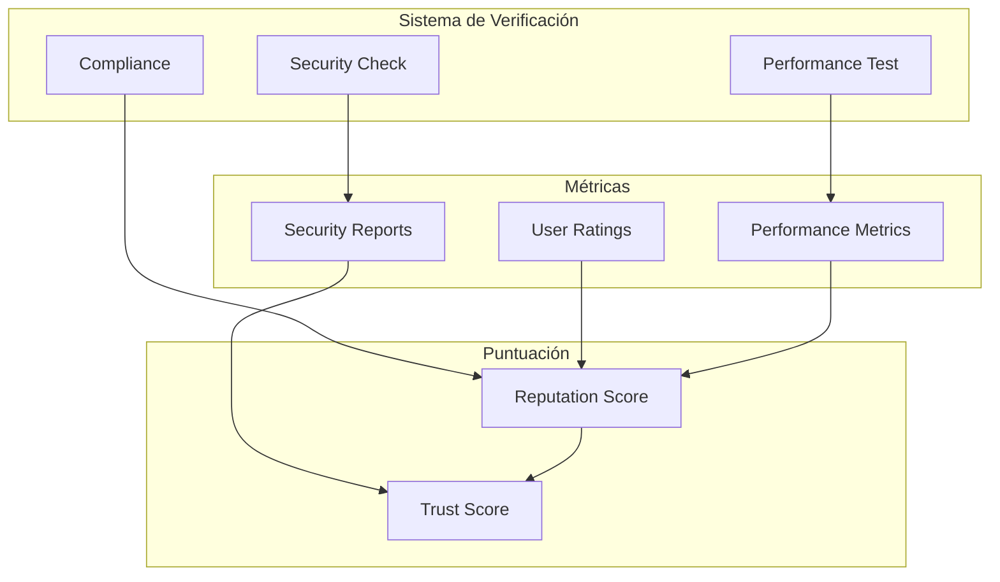

# Visualizaciones del Marketplace de Agentes IA

## Arquitectura General del Sistema
- **Propósito**: Mostrar la estructura general del marketplace y sus componentes principales
- **Audiencia**: Desarrolladores y stakeholders técnicos
- **Elementos clave**: Componentes core, integraciones, flujos de datos
- **Notas**: Las conexiones muestran dependencias principales

## Flujo de Interacción de Agentes
- **Propósito**: Visualizar el proceso de interacción entre usuarios y agentes
- **Audiencia**: Desarrolladores de agentes y usuarios técnicos
- **Elementos clave**: Secuencia de operaciones, puntos de interacción
- **Notas**: Enfoque en el flujo principal de uso

## Jerarquía de Componentes
- **Propósito**: Mostrar la organización jerárquica de los componentes del sistema
- **Audiencia**: Arquitectos y desarrolladores
- **Elementos clave**: Estructura organizativa, dependencias
- **Notas**: Enfoque en la modularidad y extensibilidad

## Flujo de Monetización
- **Propósito**: Visualizar el sistema económico del marketplace
- **Audiencia**: Stakeholders de negocio y desarrolladores
- **Elementos clave**: Flujos económicos, modelos de ingreso
- **Notas**: Enfoque en la sostenibilidad económica

## Sistema de Reputación y Verificación
- **Propósito**: Mostrar el proceso de verificación y evaluación de agentes
- **Audiencia**: Desarrolladores y usuarios de agentes
- **Elementos clave**: Métricas, procesos de verificación
- **Notas**: Enfoque en la confiabilidad y seguridad

## Notas de Implementación
1. **Decisiones de Diseño**:
   - Arquitectura modular para facilitar extensiones
   - Separación clara de responsabilidades
   - Interfaces estandarizadas

2. **Limitaciones Identificadas**:
   - Complejidad en integraciones multi-chain
   - Latencia en verificaciones TEE
   - Escalabilidad de nodos Gaia

3. **Mejoras Futuras**:
   - Optimización de flujos de datos
   - Automatización de verificaciones
   - Expansión de integraciones

4. **Áreas de Complejidad**:
   - Gestión de estado distribuido
   - Coordinación de agentes
   - Sincronización multi-chain