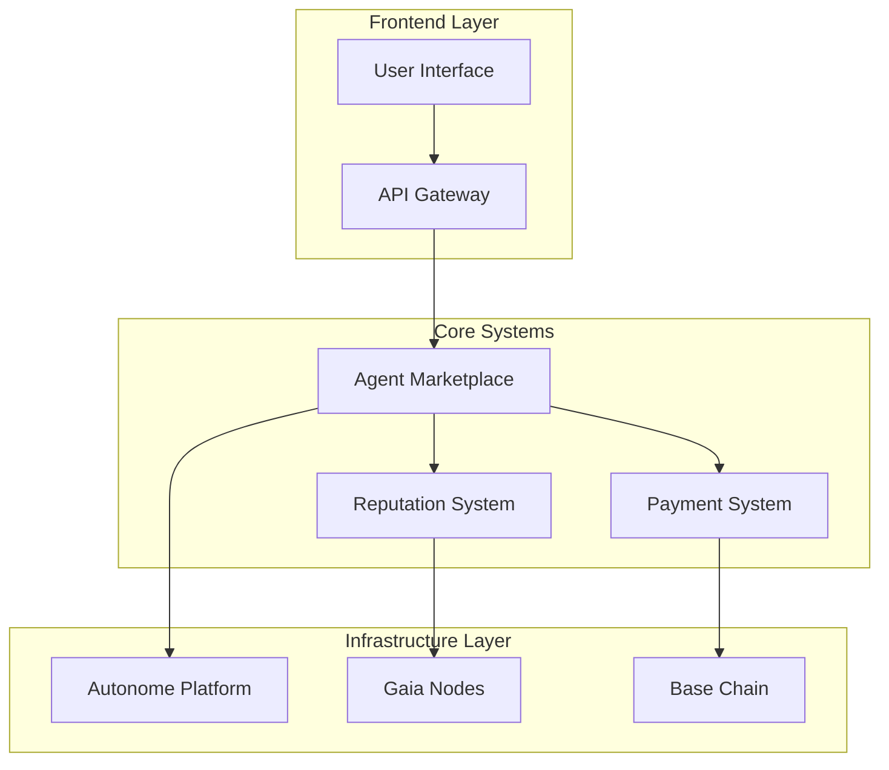

# Informe Final: Marketplace de Agentes IA para ETH Agentic Hackathon

## Resumen Ejecutivo

El presente informe detalla la investigación y análisis para el desarrollo de un marketplace de agentes IA en el contexto del ETH Agentic Hackathon. La propuesta busca crear una plataforma donde usuarios puedan contratar, alquilar o prestar agentes IA, aprovechando las tecnologías y premios ofrecidos por los patrocinadores del hackathon.

### Objetivos Principales
- Crear un marketplace descentralizado de agentes IA
- Maximizar oportunidades de premios del hackathon
- Desarrollar una solución técnicamente sólida y escalable

### Premios Potenciales Identificados
- Autonome: $7,000 (Best DeFAI Agent)
- Coinbase: $7,500 (Most Innovative)
- Base: $2,000
- Gaia: $2,500 (Mother of All Agents)
**Total Potencial**: $19,000

## Metodología

### Proceso de Análisis
1. Análisis de mercado y oportunidades
2. Desarrollo de taxonomía del sistema
3. Identificación de conceptos clave
4. Análisis de relaciones y dependencias
5. Visualización de arquitectura y flujos
6. Análisis de tendencias y dirección futura

### Herramientas y Frameworks
- Autonome Platform para hosting de agentes
- AgentKit de Coinbase para integración crypto
- Base para deployment L2
- Gaia Network para infraestructura de agentes

## Hallazgos Principales

### 1. Componentes Core Identificados
- Sistema de Agentes Autónomos
- Sistema de Monetización Multi-token
- Infraestructura de Despliegue Descentralizada
- Sistema de Reputación y Verificación
- Framework de Desarrollo de Agentes

### 2. Oportunidades Clave
- Integración multi-framework de agentes
- Sistema económico innovador
- Verificabilidad y seguridad mejorada
- Experiencia de usuario simplificada

### 3. Ventajas Competitivas
- Uso de TEE para seguridad
- Soporte multi-chain
- Sistema de reputación robusto
- Monetización flexible

## Análisis Detallado

### Arquitectura Técnica

### Sistema Económico
- Integración con AgentKit para pagos
- Modelos de revenue sharing
- Sistema de staking y reputación
- Optimización de costos en L2

### Seguridad y Verificación
- TEE para ejecución segura
- Sistema de reputación basado en métricas
- Verificación automática de agentes
- Monitoreo continuo

## Conclusiones

### Fortalezas del Proyecto
1. **Tecnológicas**:
   - Arquitectura modular y escalable
   - Integración con plataformas líderes
   - Seguridad robusta

2. **Mercado**:
   - Propuesta de valor clara
   - Modelo económico sostenible
   - Potencial de crecimiento

3. **Competitivas**:
   - Alineación con tracks del hackathon
   - Uso innovador de tecnologías
   - Enfoque en UX

### Desafíos Identificados
1. **Técnicos**:
   - Complejidad de integración multi-chain
   - Escalabilidad de verificación
   - Optimización de costos

2. **Mercado**:
   - Adopción inicial
   - Educación de usuarios
   - Competencia potencial

## Recomendaciones

### Plan de Implementación

1. **Fase 1: MVP (Hackathon)**
   - Implementar core en Autonome
   - Integrar AgentKit para pagos
   - Desarrollar UI básica
   - Desplegar en Base

2. **Fase 2: Expansión**
   - Añadir más tipos de agentes
   - Implementar governance
   - Expandir integraciones
   - Mejorar UX

3. **Fase 3: Madurez**
   - Implementar DAO
   - Expandir cross-chain
   - Optimizar sistemas
   - Escalar comunidad

### Estrategia para Hackathon

1. **Priorización de Desarrollo**
   - Enfoque en features para premios específicos
   - Desarrollo modular y reutilizable
   - Testing exhaustivo
   - Documentación clara

2. **Presentación**
   - Demo enfocado en innovación
   - Énfasis en integración técnica
   - Mostrar potencial futuro
   - Destacar impacto en usuario

### Maximización de Premios

1. **Autonome Track**
   - Enfatizar uso innovador de TEE
   - Demostrar escalabilidad
   - Mostrar verificabilidad

2. **Coinbase Track**
   - Destacar uso creativo de AgentKit
   - Mostrar integración multi-chain
   - Enfatizar UX simplificada

3. **Base Track**
   - Demostrar optimización L2
   - Mostrar eficiencia en costos
   - Enfatizar accesibilidad

4. **Gaia Track**
   - Destacar uso de nodos
   - Mostrar personalización
   - Enfatizar descentralización

## Apéndices

### A. Referencias Técnicas
- Documentación de Autonome
- Guías de AgentKit
- Especificaciones de Base
- APIs de Gaia

### B. Métricas Clave
- Performance de agentes
- Costos de operación
- Tiempos de respuesta
- Métricas de seguridad

### C. Recursos Adicionales
- Repositorio de código
- Documentación API
- Guías de integración
- Material de presentación